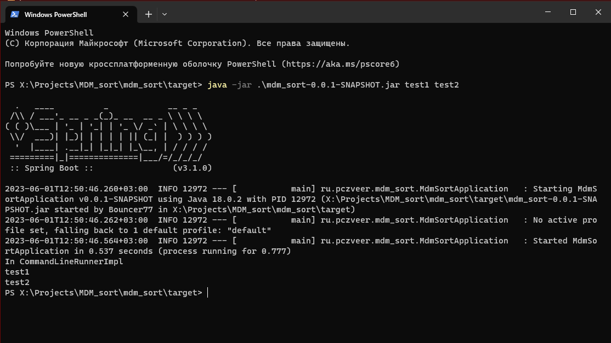

# Описание задачи в виде черного ящика

## Входные данные

Текстовый файл в формате:

```txt
<термин 1> - <определение 1>
<термин 2> - <определение 2>
...
<термин 3> - <определение 3>
```

Объем файла 8 ГБ

## Выходные данные

Аналогичный по формату текстовый файл, но с отсортированными терминами в лексикографическом порядке

## Пример данных

### Пример входных данных

```txt
априорная информация [aprior information ] и апостериорная информация [aposterior information] - Соответственно, - данные, имевшиеся до проведения какого-либо опыта или другого действия, и сведения, полученные после его выполнения;
коммерческая информация [commercial information] - Данные , сведения и содержащие их документы, являющиеся объектом продажи их собственником;
личная информация [private information] - Сведения (данные) о гражданах и организациях, затрагивающие их интересы и запрещенные для распространения без их согласия;
библиографическая информация [bibliographic information] - Библиографические данные, описания и их перечни;
графическая информация [graphical (pictorial, image, pattern) information] - Сведения или данные, представленные в виде схем, эскизов, изображений, графиков, диаграмм, символов;
ретроспективная информация [retrospective information] - Сведения, содержащиеся в накопленных за два и более лет массивах данных или полученные в результате поиска в этих массивах (так называемого - ретроспективного поиска ).
```

### Пример выходных данных

Термины отсортированный в лексикографическом порядке

```txt
априорная информация [aprior information ] и апостериорная информация [aposterior information] - Соответственно, - данные, имевшиеся до проведения какого-либо опыта или другого действия, и сведения, полученные после его выполнения;
библиографическая информация [bibliographic information] - Библиографические данные, описания и их перечни;
графическая информация [graphical (pictorial, image, pattern) information] - Сведения или данные, представленные в виде схем, эскизов, изображений, графиков, диаграмм, символов;
коммерческая информация [commercial information] - Данные , сведения и содержащие их документы, являющиеся объектом продажи их собственником;
личная информация [private information] - Сведения (данные) о гражданах и организациях, затрагивающие их интересы и запрещенные для распространения без их согласия;
ретроспективная информация [retrospective information] - Сведения, содержащиеся в накопленных за два и более лет массивах данных или полученные в результате поиска в этих массивах (так называемого - ретроспективного поиска ).
```

# Запуск приложения

